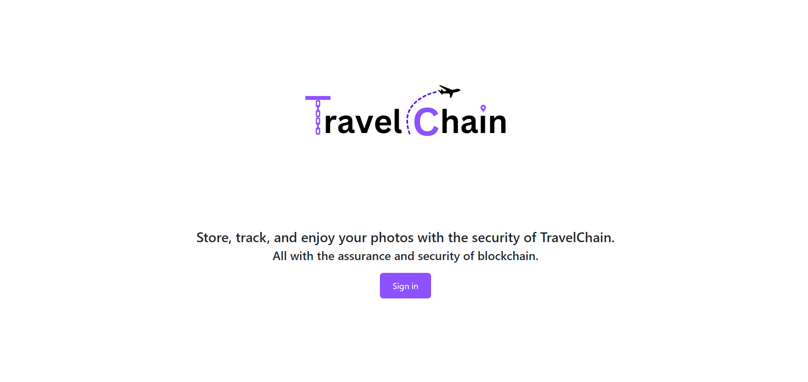
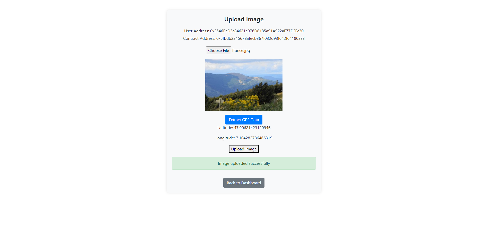
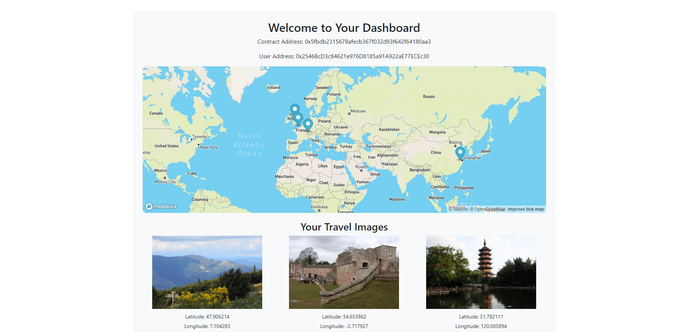

## Inspiration
I love traveling and wanted to incorporate it with blockchain.
## What it does
Allows users to track, store, and enjoy their photos in an interactive map using mapbox api.
## How I built it
I used react.js, solidity, firebase, mapbox api, and hardhat to test it.
## Challenges I ran into
I ran into multiple challenges integrating the smart contract with the frontend fetching data correctly.

## Accomplishments that I'm proud of
I was able to get based the integration errors and make a full working dApp for the first time.
## What I learned
A lot about blockchain and the inter workings behind it
## What's next for Travel Chain 
Perhaps a full-fledged website?

